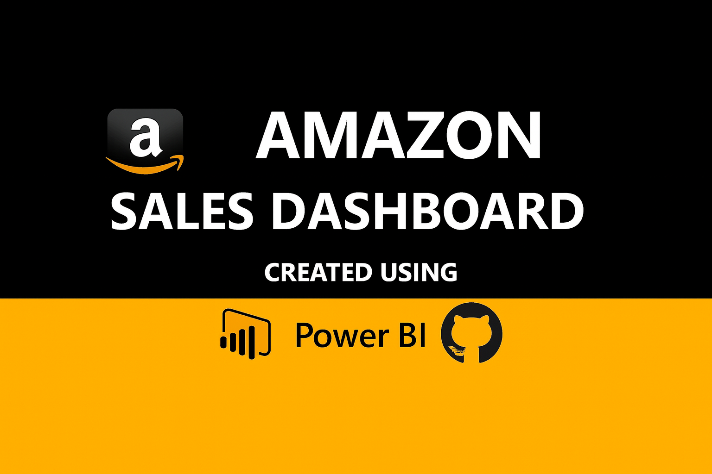

  

# Amazon-Sales-Dashboard
A comprehensive Power BI dashboard for visualizing Amazon sales, profitability, and key business performance metrics.

## 📊 Overview
This repository contains a comprehensive Power BI dashboard designed to visualize and analyze key sales, inventory, and performance metrics for an Amazon business. The dashboard provides interactive insights to monitor business health, identify trends, and make data-driven decisions.

## ✨ Features
The dashboard typically includes visualizations and key performance indicators (KPIs) covering areas such as:

* **Sales Performance:** Daily, weekly, and monthly revenue trends.
* **Product Analysis:** Top-performing products, sales by category, and product profitability.
* **Inventory Management:** Stock levels, days of inventory, and low stock alerts.
* **Customer Insights:** Order volume, return rates, and geographical distribution of sales.
* **Advertising Performance:** Spend, ACoS (Advertising Cost of Sales), and campaign effectiveness (if applicable).

## 🚀 Getting Started

### Prerequisites

To view and interact with this dashboard, you will need:

* **[Microsoft Power BI Desktop](https://powerbi.microsoft.com/en-us/downloads/)** (Free to download)
  
###🚀 Get the Dashboard

This is a premium template designed to be used with your own Amazon data exports (CSV/Excel).

Click the link below to purchase and download the full .pbix file, setup instructions, and data dictionary:

Link to Dashboard: https://munawer3.gumroad.com/l/rlhnlk

### Data Source Refresh

The dashboard is configured to connect to your Amazon data source (e.g., CSV exports, SQL database, or Amazon Seller/Vendor Central API feeds).

* **To Refresh Data:** In Power BI Desktop, click the **Refresh** button on the Home tab.
* **Note:** If the underlying data sources have moved or if you are using this file for the first time, you may need to update the data source settings under **Home > Transform Data > Data source settings**.

## 🛠️ Customization and Development

This dashboard is fully customizable. You can:

* Add new visualizations and pages.
* Modify existing measures (DAX formulas) to refine calculations.
* Change the data source connection to point to your specific Amazon data files or APIs.

## 🤝 Contribution

Feel free to open an issue or submit a pull request if you have suggestions for new features, bug fixes, or performance improvements to the dashboard or its associated data model.

## 📧 Contact

If you have any questions or need further assistance, please contact:

Munnawer Jabeen
* [GitHub Profile](https://github.com/Mjabeen164/Mjabeen164)

